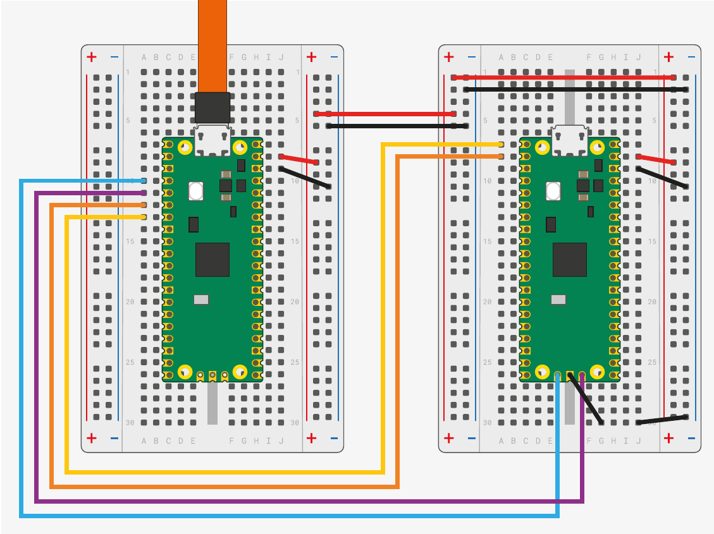

# Rust microcontroller debugging

Instructions on how to set up and use debugging features on microcontrollers when programming in Rust. 
Examples will use the Raspberry Pi Pico and a VSCode environment.

## Debugging using GDB

To use GDB (either directly or from VSCode) you need to have a probe (like J-Link, CMSIS-DAP, Picoprobe), some 
boards have them incorporated, while for some you need to use an external one. 

### Debug probe
The Raspberry Pi Pico doesn't have one, but you can use a secnd Pico as a probe. The official documentation
explains how to use Picoprobe together with OpenOCD, this works well, except that it doesn't support
Real-Time Transfer (which I want to use for debugging messages). I will use [DapperMime](https://github.com/majbthrd/DapperMime),
which is a CMSIS-DAP compatible probe for the Pico.

On the Github page there is a [releases page](https://github.com/majbthrd/DapperMime/releases), you can download the .uf2 file
from there. Plug the USB cable into the debugger Pico while pressing the BOOTSEL button, and copy the file on the mounted
filesystem. Now wire the debugger (Pico 1) and debugged (Pico 2) Picos like shown in the image below. Only the blue and purple wires, which go into the 
debug port of the second Pico are needed (and the ground).



To be able to access the probe without root access, add a new udev rule:
```
# /etc/udev/rules.d/50-pyocd.rules

ATTRS{idVendor}=="cafe", ATTRS{idProduct}=="4005", MODE="660", GROUP="plugdev", TAG+="uaccess"
```

### PyOCD

For the host debugger, I will use [PyOCD](https://pyocd.io/), because I found that it works with less tinkering
than OpenOCD. To install PyOCD run:

```
python3 -m pip install -U pyocd
```

It will probably be installed in `~/.local/bin`, add it to the PATH if needed.

### Debugging a program

Now build and upload the program you want to debug on Pico 2 and plug both 
Picos into your computer. First you need to run PyOCD (it should detect the probe automatically):

```
pyocd gdbserver -t rp2040
```

Run GDB (the standard install should have support for connecting to any GDB server, if not you need multiarch or the ARM specific one), 
the server should run on port 3333.

```
gdb [path to executable]

[gdb] target extended-remote localhost:3333

[gdb] load                # to upload a new executable to the device
[gdb] monitor reset       # to reset the execution
[gdb] monitor reset halt  # to reset and stop at entry point

# Now you can set breakpoints and and use GDB as usual

```

## Debug from VSCode

To use GDB from VSCode, some configuration is needed.

The `Cortex-Debug` plugin should be installed. After this, create a `.vscode` directory in the root of your project.
There you will add 2 files: `launch.json` and optionally `tasks.json`.

```
// launch.json

{
    "version": "0.2.0",
    "configurations": [
        {
            "name": "Pico Debug",
            "cwd": "${workspaceRoot}",
            "executable": "${workspaceRoot}/target/thumbv6m-none-eabi/debug/[PROGRAM_NAME]",
            "request": "launch",
            "type": "cortex-debug",
            "servertype": "external",
            // This may need to be arm-none-eabi-gdb depending on your system
            "gdbPath": "gdb",
            "gdbTarget": "localhost:3333",
            "preLaunchTask": "cargo build",     # this is optional, it just rebuils the program before debugging
            "device": "RP2040",
            "configFiles": [
                "interface/raspberrypi-swd.cfg",
                "target/rp2040.cfg"
            ],
            "runToMain": true,
            // Work around for stopping at main on restart
            "postRestartCommands": [
                "monitor reset halt",
                "continue"
            ]
        }
    ]
}

```

```
// tasks.json

{
	"version": "2.0.0",
	"tasks": [
		{
			"label": "cargo build",
			"type": "shell",
			"command": "~/.cargo/bin/cargo",
			"args": [
				"build"
			],
			"problemMatcher": [
				"$rustc"
			],
			"group": {
				"kind": "build",
				"isDefault": true
			}
		},
	]
}
```

Now just run PyOCD like in the GDB example, go to the Debug tab in VSCode and run the Pico Debug option.
It should stop at the entry function, where you can start debugging.

## Printing using defmt

Rust's `defmt` (deffered formatting) can be used to get the output from the Pico using the debug probe.

To use it add the following dependencies:

```
defmt = "0.3.2"
defmt-rtt = "0.4.0"         # global logger
panic-probe = { version = "0.3.0", features = ["print-defmt"] }  # print stacktrace on panic
```

And in the `.cargo/config.toml` add it as a linking argument:

```
rustflags = [
  ...
  "-C", "link-arg=-Tdefmt.x",
]
```

In the code, import the following:

```
use panic_probe as _;
use defmt_rtt as _;
```

And finally use the `defmt::println!()` macro as you would use the standard `println!`, or use one of the logging macros.

To actually see the output, you need something to receive the RTT messages, for example `probe-run`. You can install it using cargo:

```
cargo install probe-run
```

To upload and run your program use:

```
probe-run --chip RP2040 [program to run]
```

This can be added in the `config.toml` file as the runner to just use `cargo run`:

```
runner = "probe-run --chip RP2040"
```